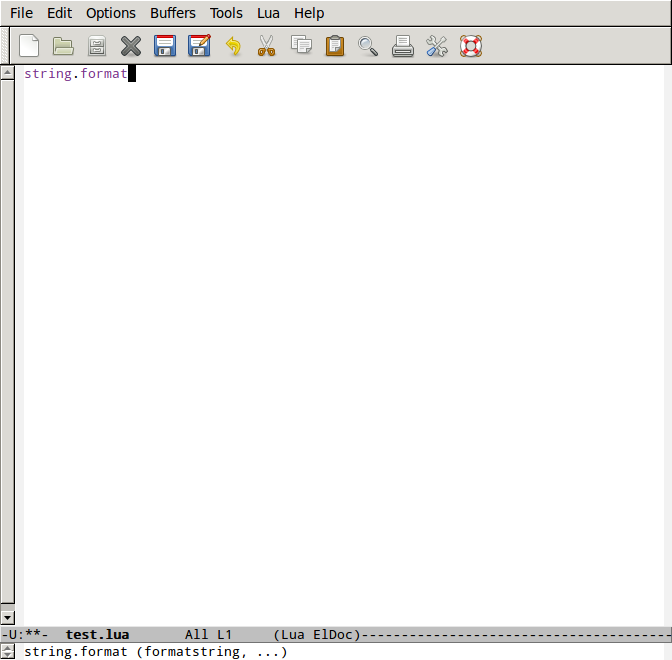

# Lua Eldoc Mode #

This is a minor mode for emacs that displays in the minibuffer the
arguments that the default Lua functions receive when the cursor is
pointing to one of them.

## Screenshot ##

## Instalation ##

### Using Melpa (not yet available) ###

Hopefully I'll add this file to Melpa one day.

### Manual instalation ###

Download the "lua-eldoc-mode.el" and place it somewhere in your
load-path.

Then open your .emacs and add the following lines:

    (require 'lua-eldoc-mode)
    (add-hook 'lua-mode-hook 'lua-eldoc-mode)
